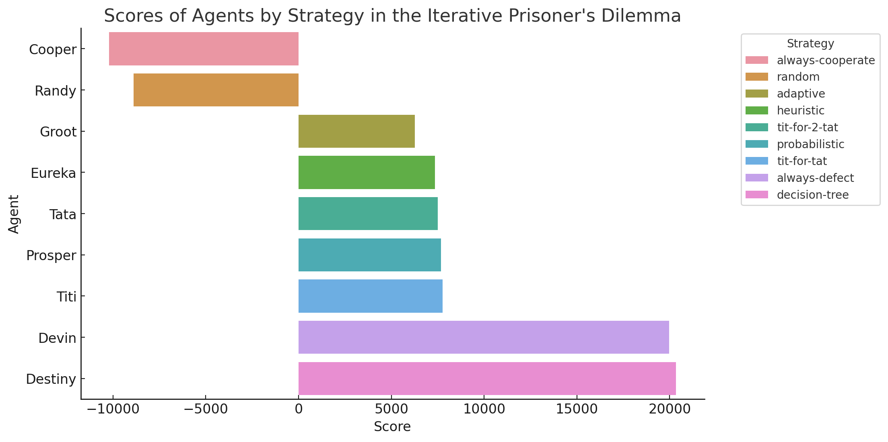

# game-theory
Diving deeper into the idea of using machine learning to develop adaptive strategies in game theory, particularly in the context of Axelrod's work on tit-for-tat strategies in the iterated prisoner's dilemma, offers a rich avenue for research. Here's a more detailed exploration of this idea:

## Results

## Research Objective
Primary Goal: To develop and analyze adaptive strategies in game-theoretical models, particularly in the context of the iterated prisoner's dilemma, using machine learning techniques.
Secondary Goals: Understand the evolution of cooperation and competition, and identify conditions under which certain strategies prevail.
Methodology
